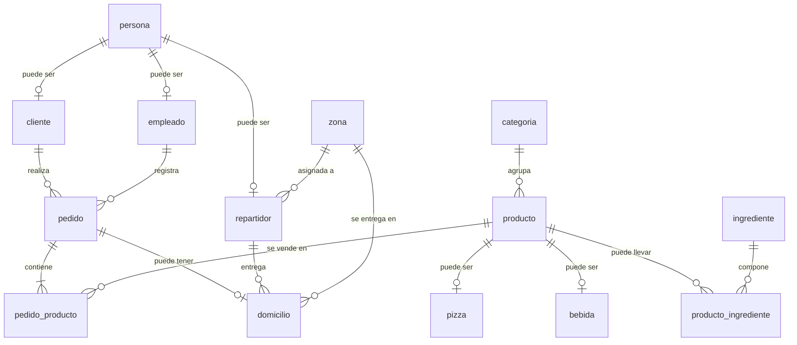

# 🍕 Pizzería Don Piccolo - Sistema de Gestión

## Descripción
Sistema de base de datos para gestionar pedidos, domicilios, clientes y productos de una pizzería en Bucaramanga.

## Modelo Entidad-Relación

## Tablas Principales

### Herencia de Persona
- **persona**: datos básicos (nombre, apellido, teléfono, documento)
- **cliente**: clientes que realizan pedidos
- **empleado**: personal que atiende
- **repartidor**: personal que entrega domicilios

### Herencia de Producto
- **categoria**: tipos de productos (pizzas, bebidas)
- **producto**: información general de todos los productos
- **pizza**: detalles específicos (tamaño, tipo)
- **bebida**: detalles específicos (tamaño)

### Sistema de Pedidos
- **pedido**: órdenes de clientes
- **pedido_producto**: productos en cada pedido
- **domicilio**: información de entrega
- **zona**: zonas de cobertura con tarifas

### Otros
- **ingrediente**: materia prima
- **producto_ingrediente**: recetas
- **historial_precios**: auditoría de cambios
